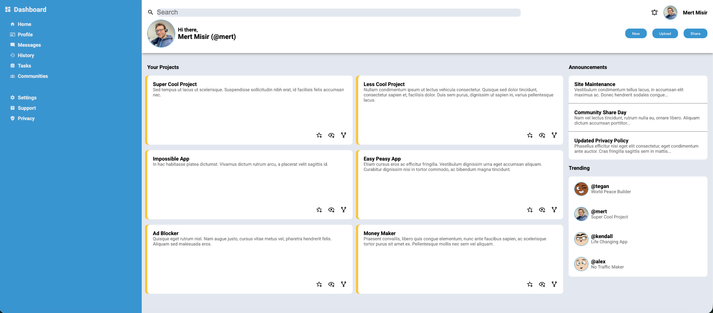

# Admin Dashboard

A responsive admin dashboard built with HTML and CSS as part of The Odin Project intermediate curriculum.

## Preview

## Features

- Sidebar navigation with icons and grouped menu items
- Header with search bar, user profile, notifications, and action buttons
- Project cards grid with star, preview, and fork actions
- Announcements section with dividers
- Trending users section with profile pictures

## What I Learned

- **CSS Grid** for the main page layout (sidebar, header, main content)
- **Flexbox** for one-dimensional layouts (navigation items, search bar, buttons)
- When to use Grid vs Flexbox — Grid for 2D layouts, Flex for 1D
- `overflow: hidden` + `border-radius: 50%` for circular profile pictures
- `object-fit: cover` for responsive images
- `box-shadow` for left border accent effect on cards
- `.container > div` vs `.container div` — direct child vs all descendants
- `align-self: start` to prevent grid item stretching
- `flex: 1` to push card action icons to the bottom
- Wrapper div pattern for separating visual styles from layout

## Built With

- HTML5
- CSS3 (Grid & Flexbox)
- [Material Design Icons](https://pictogrammers.com/library/mdi/)
- [Profile Pictures](https://dicebear.com/)

## Live Demo

[Admin Dashboard Live](https://arifmertmisir.github.io/admin-dashboard/)
